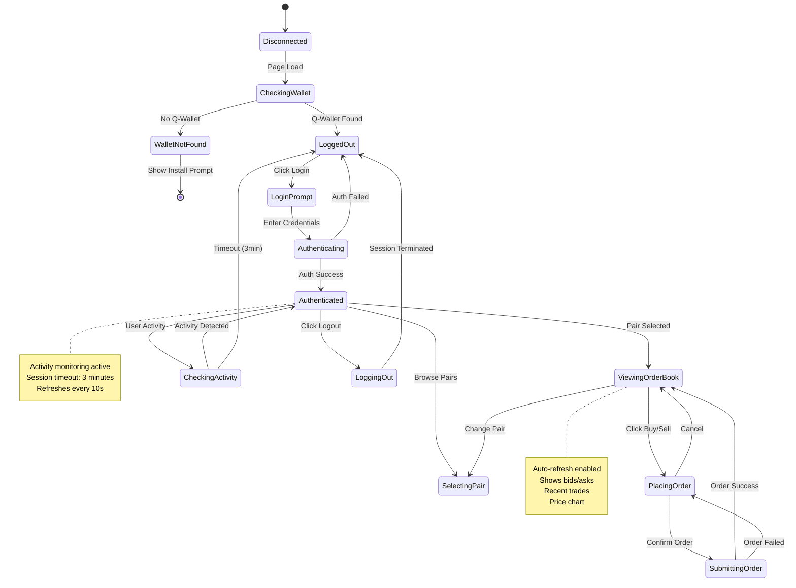
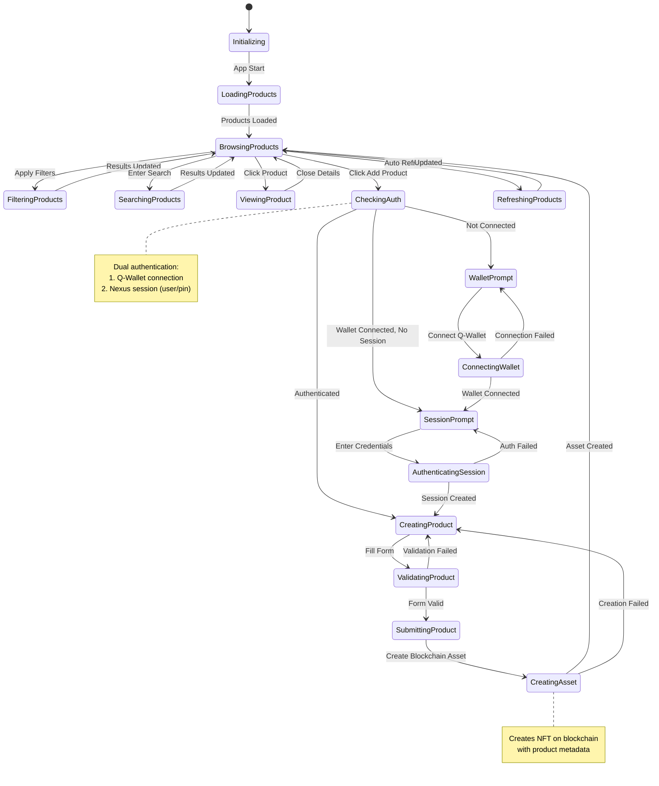
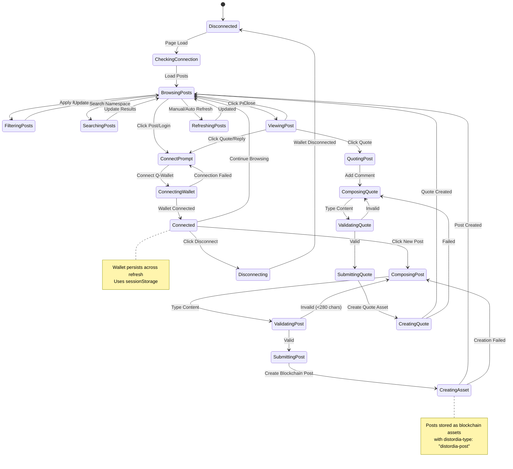
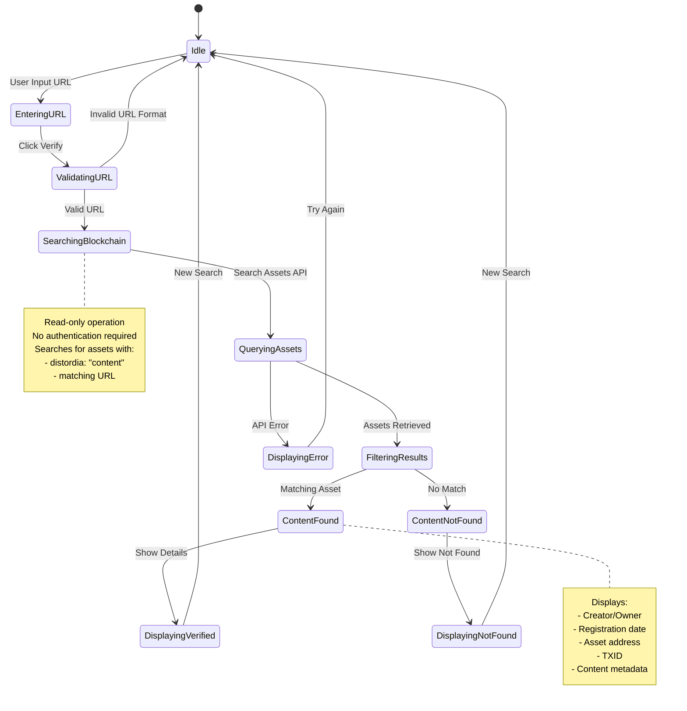
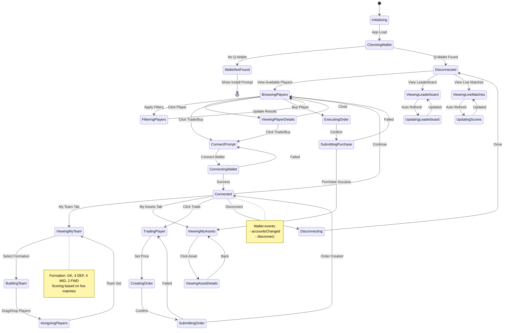
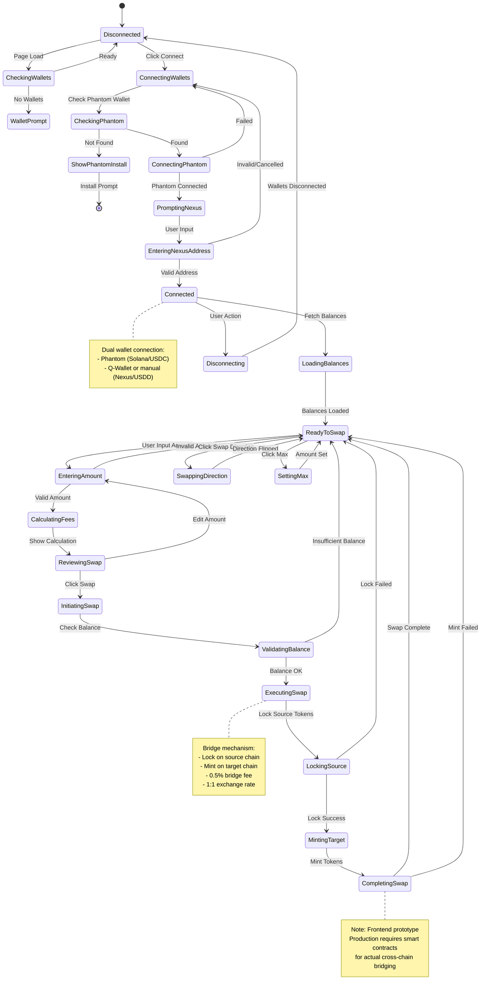

# Distordia dApp State Machine Diagrams

This document contains state machine diagrams for each dApp in the Distordia ecosystem, showing the state transitions and user flows.

## 1. DEX (Decentralized Exchange)

## 2. Masterdata (Product Catalog)

## 3. Social (On-Chain Social Media)

## 4. Content Verification

## 5. Fantasy Football

## 6. Swap (Cross-Chain Bridge)

## State Transition Patterns

### Common Patterns Across Apps

1. **Wallet Connection Pattern** (DEX, Masterdata, Social, Fantasy Football, Swap)
   - Check for wallet availability
   - Connect on user action
   - Handle connection failures
   - Persist connection state
   - Listen for disconnect events

2. **Authentication Pattern** (DEX, Masterdata)
   - Wallet connection + Session creation
   - Username/password or username/pin
   - Session timeout monitoring
   - Activity tracking
   - Automatic logout on timeout

3. **Data Loading Pattern** (All apps)
   - Initial load on page mount
   - Show loading indicators
   - Handle API errors with fallbacks
   - Auto-refresh for live data
   - Manual refresh option

4. **Asset Creation Pattern** (Masterdata, Social, Fantasy Football)
   - Require authentication
   - Validate input
   - Submit to blockchain
   - Handle transaction confirmation
   - Update UI on success

5. **Filtering/Search Pattern** (DEX, Masterdata, Social, Fantasy Football)
   - Apply filters to loaded data
   - Debounced search input
   - Clear filters option
   - Update display instantly

### State Management Approaches

- **DEX**: Explicit state object (`state.js`) with global functions
- **Masterdata**: Class-based state within `ProductCatalogue` class
- **Social**: Module-level state variables with function-based management
- **Content Verification**: Class-based state within `ContentVerification` class
- **Fantasy Football**: Global state objects with function-based management
- **Swap**: Module-level state variables with function-based management

### Key State Variables by App

**DEX:**
- `currentPair` - selected trading pair
- `marketData` - all pairs and market data
- `sessionData` - user session and authentication

**Masterdata:**
- `products` - all product assets
- `currentFilters` - active filter criteria
- `currentProduct` - selected product details

**Social:**
- `currentPosts` - loaded posts
- `isConnected` - wallet connection status
- `userAddress` - connected wallet address
- `quotedPostsCache` - cache for quoted post data

**Content Verification:**
- `currentResult` - verification result data

**Fantasy Football:**
- `myAssets` - user's player NFTs
- `myTeam` - user's team formation
- `allPlayers` - available players
- `liveMatches` - ongoing matches
- `walletConnected` - connection state

**Swap:**
- `walletConnected` - connection status
- `solanaWallet` - Solana wallet address
- `nexusWallet` - Nexus wallet address
- `fromAmount`/`toAmount` - swap amounts
