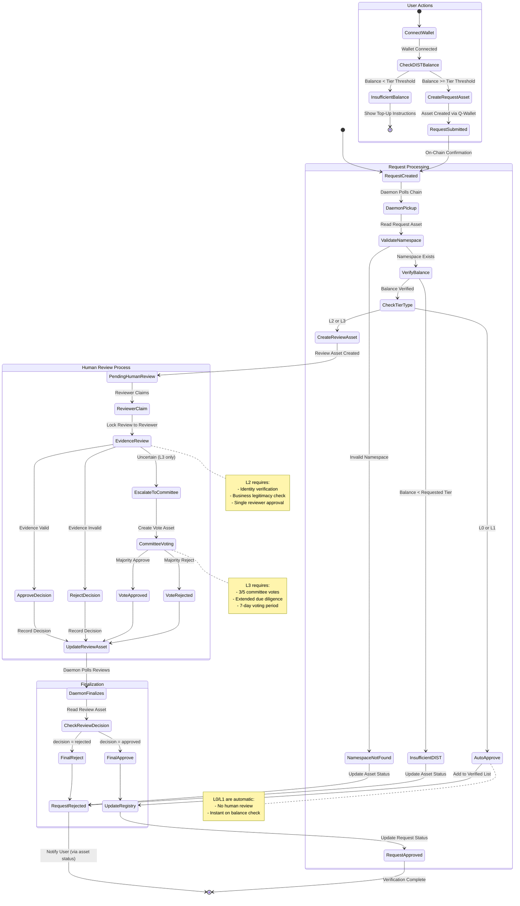
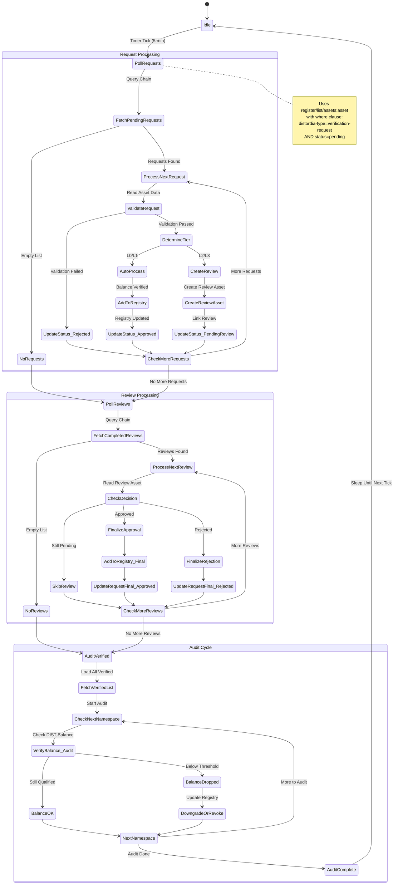
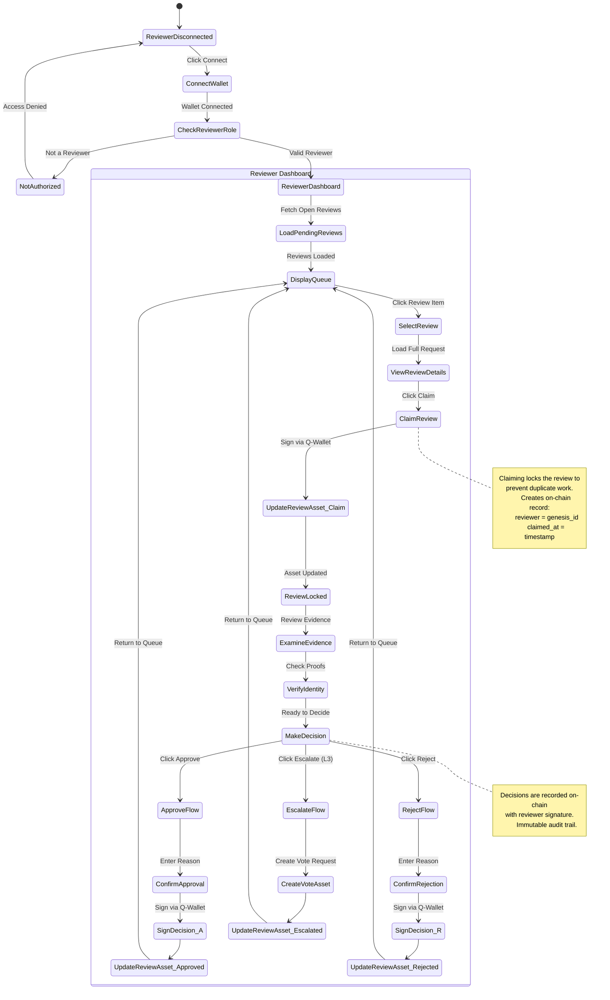
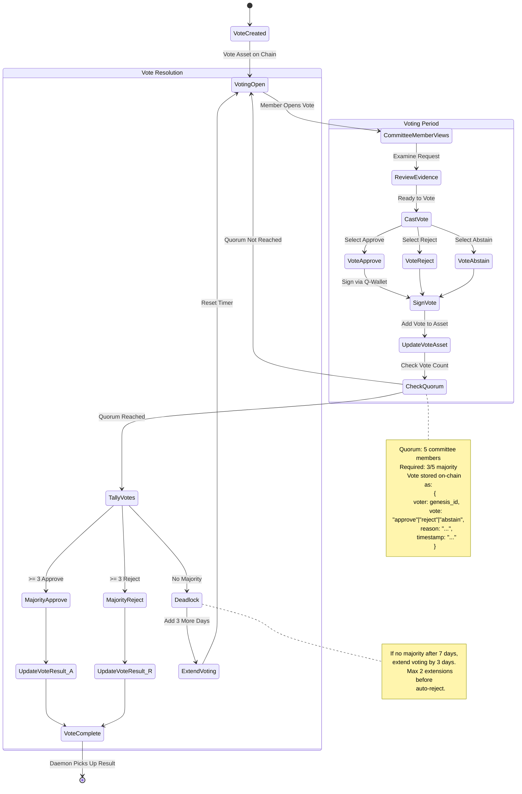

# Fully On-Chain Verification System

This document outlines how namespace verification can happen **entirely on the Nexus blockchain**, from initial request to daemon processing to human oversight for higher tiers.

## Overview

The system leverages Nexus blockchain capabilities:
- **Assets** as immutable/updatable request records
- **Token transfers** (DIST) for staking requirements
- **Register queries** for public verification
- **Asset updates** for status changes

---

## Core Concepts

### 1. On-Chain Request Asset

When a user requests verification, an **asset** is created on-chain containing:

```json
{
    "owner": "<genesis ID>", // default asset attribute - creator ID
    "created": 1234567890, // default asset attribute - creation timestamp
    "updated": 1234567890, // default asset attribute - last change timestamp
    "distordia-type": "verification-request",
    "namespace": "mycompany",
    "requested_tier": "L2",
    "status": "pending",
    "dist_balance_snapshot": 15000,
    "contact": "optional@email.com",
    "evidence_url": "https://example.com/proof",
    "message": "Requesting L2 verification"
}
```

### 2. Tier-Based Processing Model

| Tier | DIST Required | Processing Mode | Human Review |
|------|--------------|-----------------|--------------|
| **L0** | 1 | Automatic | None |
| **L1** | 1,000 | Automatic | None |
| **L2** | 10,000 | Semi-automatic | Required |
| **L3** | 100,000 | Manual | Committee vote |

### 3. Human Oversight Asset

For L2/L3 tiers, a separate **review asset** is created:

```json
{
    "owner": "<genesis ID>", // default asset attribute - creator ID
    "created": 1234567890, // default asset attribute - creation timestamp
    "updated": 1234567890, // default asset attribute - last change timestamp
    "distordia-type": "verification-review",
    "request_address": "87Vm...",
    "namespace": "mycompany",
    "tier": "L2",
    "status": "pending-review",
    "reviewer": null,
    "review_deadline": "2026-02-03T12:00:00Z",
    "votes": [],
    "decision": null
}
```

---

## State Machine: Complete Verification Flow



---

## State Machine: Daemon Processing Loop



---

## State Machine: Human Review Interface



---

## State Machine: Committee Voting (L3)



---

## On-Chain Asset Structures

### 1. Verification Request Asset

Created by user via Q-Wallet:

```json
{
    "distordia-type": "verification-request",
    "version": 1,
    "namespace": "target-namespace",
    "genesis": "a1b2c3d4...",
    "requested_tier": "L2",
    "status": "pending",
    "dist_balance_snapshot": 15000,
    "created": "2026-01-27T12:00:00Z",
    "processed": null,
    "message": "Optional message from requester",
    "evidence_url": "https://example.com/verification-proof",
    "contact": "contact@namespace-owner.com"
}
```

**Status transitions:**
- `pending` → `validating` → `approved` | `rejected` | `pending-review`

### 2. Verification Review Asset

Created by daemon for L2/L3 requests:

```json
{
    "distordia-type": "verification-review",
    "version": 1,
    "request_address": "87VmNhit...",
    "namespace": "target-namespace",
    "tier": "L2",
    "status": "open",
    "created": "2026-01-27T12:05:00Z",
    "deadline": "2026-02-03T12:05:00Z",
    "reviewer": null,
    "claimed_at": null,
    "decision": null,
    "decision_reason": null,
    "decided_at": null
}
```

**Status transitions:**
- `open` → `claimed` → `approved` | `rejected` | `escalated`

### 3. Committee Vote Asset (L3)

Created when L3 review is escalated:

```json
{
    "distordia-type": "verification-vote",
    "version": 1,
    "review_address": "88AbCd...",
    "namespace": "target-namespace",
    "status": "voting",
    "created": "2026-01-27T12:10:00Z",
    "deadline": "2026-02-03T12:10:00Z",
    "extensions": 0,
    "votes": [
        {
            "voter": "genesis_id_1",
            "vote": "approve",
            "reason": "Valid business entity, documentation verified",
            "timestamp": "2026-01-28T09:00:00Z"
        },
        {
            "voter": "genesis_id_2", 
            "vote": "approve",
            "reason": "Confirmed identity and track record",
            "timestamp": "2026-01-28T14:30:00Z"
        }
    ],
    "result": null
}
```

### 4. Verified Registry Asset

Managed by daemon:

```json
{
    "distordia-type": "verification-registry",
    "tier": "L2",
    "version": 1,
    "updated": "2026-01-27T12:30:00Z",
    "namespaces": [
        {
            "namespace": "verified-company",
            "genesis": "abc123...",
            "verified": "2026-01-27T12:30:00Z",
            "balance": 15000,
            "request_address": "87Vm...",
            "review_address": "88Ab..."
        }
    ]
}
```

---

## Efficient Human Oversight Implementation

### 1. Reviewer Dashboard Web App

Create a dedicated reviewer interface at `/verification/review/`:

```
/verification/review/
├── index.html          # Reviewer dashboard
├── review.css          # Styling
├── review.js           # Logic
└── README.md           # Reviewer guidelines
```

**Features:**
- Queue of open reviews (filtered by reviewer's authorized tiers)
- Claim mechanism with on-chain locking
- Evidence viewer with linked proof URLs
- One-click approve/reject with reason input
- Committee voting interface for L3
- History of past decisions

### 2. Notification System via Asset Watching

The daemon can create **notification assets** that reviewers watch:

```json
{
    "distordia-type": "reviewer-notification",
    "recipient": "reviewer_genesis",
    "type": "new-review",
    "review_address": "88Ab...",
    "namespace": "target-namespace",
    "tier": "L2",
    "created": "2026-01-27T12:05:00Z",
    "read": false
}
```

Reviewers poll for their notifications or use WebSocket subscriptions if available.

### 3. Reviewer Authorization Asset

Track authorized reviewers on-chain:

```json
{
    "distordia-type": "reviewer-registry",
    "version": 1,
    "reviewers": [
        {
            "genesis": "reviewer_1_genesis",
            "tiers": ["L2"],
            "added": "2025-01-01T00:00:00Z",
            "active": true
        },
        {
            "genesis": "reviewer_2_genesis",
            "tiers": ["L2", "L3"],
            "added": "2025-06-01T00:00:00Z",
            "active": true
        }
    ],
    "committee_members": [
        "committee_1_genesis",
        "committee_2_genesis",
        "committee_3_genesis",
        "committee_4_genesis",
        "committee_5_genesis"
    ]
}
```

---

## API Endpoints Used

### Read Operations (Public)

| Operation | Endpoint | Purpose |
|-----------|----------|---------|
| Get pending requests | `register/list/assets:asset` + `where=distordia-type=verification-request AND status=pending` | Daemon polling |
| Get open reviews | `register/list/assets:asset` + `where=distordia-type=verification-review AND status=open` | Reviewer queue |
| Get completed reviews | `register/list/assets:asset` + `where=distordia-type=verification-review AND decision!=null` | Daemon finalization |
| Get active votes | `register/list/assets:asset` + `where=distordia-type=verification-vote AND status=voting` | Committee voting |
| Check DIST balance | `finance/get/account` with `name=namespace::DIST-verification` | Balance verification |
| Get verified list | `assets/get/asset` with registry name | Public verification check |

### Write Operations (Authenticated)

| Operation | Endpoint | Actor |
|-----------|----------|-------|
| Create request | `assets/create/asset` | User (Q-Wallet) |
| Update request status | `assets/update/asset` | Daemon |
| Create review | `assets/create/asset` | Daemon |
| Claim review | `assets/update/asset` | Reviewer (Q-Wallet) |
| Submit decision | `assets/update/asset` | Reviewer (Q-Wallet) |
| Create vote | `assets/create/asset` | Daemon |
| Cast vote | `assets/update/asset` | Committee (Q-Wallet) |
| Update registry | `assets/update/asset` | Daemon |

---

## Implementation Phases

### Phase 1: Automatic Verification (L0/L1)
1. User creates request asset via Q-Wallet
2. Daemon polls, validates, and auto-approves
3. Fully automated, no human intervention

### Phase 2: Semi-Automatic (L2)
1. Add review asset creation
2. Build reviewer dashboard
3. Implement claim/decide workflow
4. Daemon finalizes based on review decision

### Phase 3: Committee Voting (L3)
1. Add vote asset creation
2. Build committee voting interface
3. Implement quorum checking and tallying
4. Add deadline extensions and auto-reject

### Phase 4: Advanced Features
1. Appeal process (disputed decisions)
2. Reviewer reputation tracking
3. Automated evidence verification (DNS TXT records, etc.)
4. Multi-sig requirements for high-value verifications

---

## Security Considerations

1. **Immutable Audit Trail**: All decisions are on-chain with signatures
2. **Reviewer Authentication**: Only authorized genesis IDs can claim/decide
3. **Balance Snapshots**: Prevent gaming by recording balance at request time
4. **Timeout Protection**: Reviews expire and return to queue if unclaimed
5. **Committee Independence**: Votes are blind (not visible until quorum)
6. **Dispute Resolution**: Appeals create new review cycle with different reviewers

---

## Summary

This on-chain verification system:
- ✅ Uses Nexus assets for all request/review/vote records
- ✅ Provides immutable audit trail
- ✅ Separates automatic (L0/L1) from human-reviewed (L2/L3) tiers
- ✅ Enables efficient reviewer workflow via dashboard
- ✅ Supports committee voting for highest tier
- ✅ Maintains decentralization through on-chain governance
